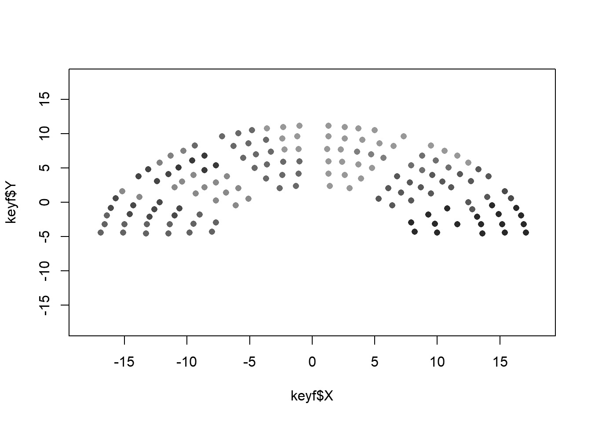

  
```{r, globalsettings, echo=FALSE, warning=FALSE, results='hide'}
library(knitr)

knitr::opts_chunk$set(echo = TRUE)
opts_chunk$set(tidy.opts=list(width.cutoff=100),tidy=TRUE, warning = FALSE, message = FALSE,comment = "#>", cache=TRUE, class.source=c("test"), class.output=c("test2"))
options(width = 100)
rgl::setupKnitr()

colorize <- function(x, color) {sprintf("<span style='color: %s;'>%s</span>", color, x) }
```

```{r klippy, echo=FALSE, include=TRUE}
klippy::klippy(position = c('top', 'right'))
#klippy::klippy(color = 'darkred')
#klippy::klippy(tooltip_message = 'Click to copy', tooltip_success = 'Done')
```

```{r setup, include=FALSE}
knitr::opts_chunk$set(echo = TRUE)
```
----
  
# Week 4 -  Twittersphere assignment
  
----
  
```{r}
# start with clean workspace
rm(list = ls())

require(RSelenium)
require(RSiena)
require(scholar)
require(tidyverse)
require(openalexR)
require(jsonlite)
require(lavaan)
require(xml2)
require(rvest)
require(kableExtra)
require(devtools)
require(igraph)
require(network)
require(sna)
require(ggraph)
require(visNetwork)
require(threejs)
require(networkD3)
#require(ndtv)
```

```{r}
load("twitter_20190919.RData")  #change to your working directory
str(twitter_20190919, 1)
keyf <- twitter_20190919[[1]]
mydata <- twitter_20190919[[2]]
seats <- twitter_20190919[[3]]
```

```{r}
fnet <- mydata$depvars$fnet
atmnet <- mydata$depvars$atmnet
rtnet <- mydata$depvars$rtnet

vrouw <- mydata$cCovars$vrouw
partij <- mydata$cCovars$partij
ethminz <- mydata$cCovars$ethminz
lft <- mydata$cCovars$lft

# if you construct an object for RSiena, covariates are mean centered by default. I would like to
# have the original values again.
ethminz <- ethminz + attributes(ethminz)$mean
partij <- partij + attributes(partij)$mean
vrouw <- vrouw + attributes(vrouw)$mean
lft <- lft + attributes(lft)$mean
```

```{r}
str(fnet)

fnet1 <- fnet[, , 1]  #friendship network wave 1
atmnet1 <- atmnet[, , 1]  #atmention network wave 1
# we will use wave 2 and 3 later.
atmnet2 <- atmnet[, , 2]
atmnet3 <- atmnet[, , 3]
```


```{r}
# table(fnet1, useNA='always') #uncomment if you want
fnet1[fnet1 == 10] <- 0
# table(fnet1, useNA='always') #uncomment if you want

atmnet1[atmnet1 == 10] <- 0
atmnet2[atmnet2 == 10] <- 0
atmnet3[atmnet3 == 10] <- 0
```

```{r}
G1 <- igraph::graph_from_adjacency_matrix(atmnet1, mode = "directed", weighted = NULL, diag = TRUE, add.colnames = NA,
    add.rownames = NA)
plot(G1)
```

```{r}
# we need to retrieve the edges.
edges <- igraph::as_data_frame(G1, what = "edges")

# the first variable of the data we can attach needs to be some id, thus reorder columns of keyf
keyf <- cbind(keyf$EGOid, keyf[, names(keyf) != "EGOid"])
# the name has been changed as well. Lets correct this
names(keyf)[1] <- "EGOid"

# rebuild the graph.
G1 <- graph_from_data_frame(edges, directed = TRUE, vertices = keyf)

# let us examine the attributes
vertex_attr(G1)

# thus to find the names of our MPs we could now do this:
V(G1)$Naam

plot(G1)
```
```{r}
G1 <- simplify(G1)
plot(G1)
```
```{r}
edge_density(G1)

# define undirected network
atmnet1_un <- atmnet1 == 1 & t(atmnet1) == 1

G2 <- graph_from_adjacency_matrix(atmnet1_un, mode = "undirected", weighted = NULL, diag = TRUE, add.colnames = NA,
    add.rownames = NA)

# attach data if you want
edges <- igraph::as_data_frame(G2, what = "edges")
G2 <- graph_from_data_frame(edges, directed = FALSE, vertices = keyf)
plot(G2)
```
```{r}
G2 <- simplify(G2)
plot(G2, mode = "undirected")
```
```{r}
# first make sure we don't end up with MPS who only mention themselves
diag(atmnet1_un) <- 0

# lets find the noisolates
noisolates <- rowSums(atmnet1_un, na.rm = T) > 0
# length(noisolates) sum(noisolates) if you select, select both correct nomination network as ego
# characteristics
atmnet1_un_sel <- atmnet1_un[noisolates, noisolates]
# if you are going to use the dataset keyf to add characteristics to the plot later, make sure to
# run the correct selection as well!!!
keyf_sel <- keyf[noisolates, ]

G2_sel <- graph_from_adjacency_matrix(atmnet1_un_sel, mode = "undirected", weighted = NULL, diag = TRUE,
    add.colnames = NA, add.rownames = NA)
G2_sel <- simplify(G2_sel)
plot(G2_sel, mode = "undirected")
```
```{r}
# option 1: see above.  only select MPs from the liberal party
selection <- keyf$Partij == "VVD"
# build new adjacency matrix
atmnet1_un_sel2 <- atmnet1_un[selection, selection]
# etc.

# option 2. Suppose we have attached our dataset to our graph object.  only select MPs from the
# liberal party
selection <- V(G2)$Partij == "VVD"
selection_id <- which(selection)  # this gives us a numeric variable
G_sel <- induced_subgraph(G2, v = selection_id)
plot(G_sel)
```
```{r}
# changing V
V(G2)$size = igraph::degree(G2) * 1.05  #naturally, you may use a different node-level structural characteristic here. 
plot(G2, mode = "undirected")
```
```{r}
V(G2)$label = as.character(V(G2)$Naam2)
V(G2)$label.cex = 1
V(G2)$color <- ifelse(V(G2)$Geslacht == "vrouw", "green", "blue")
plot(G2, mode = "undirected")
```
```{r}
# changing E
E(G2)$arrow.size = 0.4
E(G2)$curved = 0.3
plot(G2, mode = "undirected")
```
```{r}
# adding legend because I am working in Rmarkdown I need some {}
plot.igraph(G2, margin = 0, mode = "udirected")
legend(x = -1, y = -1, c("Female", "Male"), pch = 21, col = "#777777", pt.bg = c("green", "blue"), pt.cex = 2,
    cex = 0.8, bty = "n", ncol = 1)
```
```{r}

plot(keyf$X, keyf$Y, xlim = c(-18, 18), ylim = c(-18, 18), col = keyf$Partij_col, pch = 16)
```
```{r}
# it really depends on your plotting window (size, resolution etc.) to get consistent results you
# need to define this beforehand. won't do that now.


# give nodes coler of their party
V(G2)$color <- keyf$Partij_col

# change node size a bit
V(G2)$size = igraph::degree(G2) * 1.05 + 6

# remove the labels
V(G2)$label = ""

# less curvature
E(G2)$curved = 0.1

owncoords <- cbind(keyf$X, keyf$Y)
owncoords <- owncoords/8
owncoords[, 1] <- (owncoords[, 1] - mean(owncoords[, 1]))
owncoords[, 2] <- (owncoords[, 2] - mean(owncoords[, 2]))
plot.igraph(G2, mode = "undirected", layout = owncoords, rescale = F, margin = c(0, 0, 0, 0), xlim = c(min(owncoords[,
    1]), max(owncoords[, 1])), ylim = c(min(owncoords[, 2]), max(owncoords[, 2])))
```
```{r}
# construct adjacency matrix first define the recipricated atmentions in each wave
atmnet1_un <- atmnet1 == 1 & t(atmnet1) == 1
atmnet2_un <- atmnet2 == 1 & t(atmnet2) == 1
atmnet3_un <- atmnet3 == 1 & t(atmnet3) == 1

atmnet_weighted <- atmnet1_un + atmnet2_un + atmnet3_un

# contstruct graph / let us keep the loops note that the parameter 'weighted' is set to true.
G_w <- igraph::graph_from_adjacency_matrix(atmnet_weighted, mode = "undirected", weighted = TRUE, diag = TRUE,
    add.colnames = NA, add.rownames = NA)

# attach data
edges <- igraph::as_data_frame(G_w, what = "edges")
# inspect the weight.
edges$weight  #not a lot of variation. 

# rebuild the graph.
G_w <- graph_from_data_frame(edges, directed = FALSE, vertices = keyf)


# add changes as above
V(G_w)$color <- keyf$Partij_col
V(G_w)$size = igraph::degree(G_w) * 1.05 + 6
V(G_w)$label = ""
E(G_w)$curved = 0.1

# add the weights
E(G_w)$width <- E(G_w)$weight

plot.igraph(G_w, mode = "undirected", layout = owncoords, rescale = F, margin = c(0, 0, 0, 0), xlim = c(min(owncoords[,
    1]), max(owncoords[, 1])), ylim = c(min(owncoords[, 2]), max(owncoords[, 2])))
```
```{r}
# let us make them the color of the nodes if it is between nodes from same party.  let us make them
# red if between parties

edges <- get.adjacency(G_w)
edges_mat <- matrix(as.numeric(edges), nrow = nrow(edges))
# edges_mat

# because we have undirected, we only need the edges once ...I know ...
edges_mat[lower.tri(edges_mat)] <- 0
# table(keyf$Geslacht)

teller <- 1
coloredges <- NA
# we will loop over egos
for (i in 1:nrow(edges)) {
    # We then loop over alters
    for (j in 1:ncol(edges)) {
        # we check if there is a tie between ego and alter
        if (edges_mat[i, j] == 1) {
            # if so, we check ego and alter are from the same party if so, we give the tie the
            # color of the party
            if (keyf$Partij_col[i] == keyf$Partij_col[j]) {
                coloredges[teller] <- keyf$Partij_col[i]
            }
            # if so, we check ego and alter are from the same party if not, we give the tie a
            # transparent grey color
            if (keyf$Partij_col[i] != keyf$Partij_col[j]) {
                coloredges[teller] <- "#0000004B"
            }
            teller <- teller + 1
        }
    }
}

E(G_w)$color = coloredges

# prepare a legend
Party_names <- unique(keyf$Partij)
Party_cols <- unique(keyf$Partij_col)
# reorder
Party_names <- Party_names[c(7, 3, 9, 10, 12, 11, 5, 4, 6, 2, 8, 1, 13)]
Party_cols <- Party_cols[c(7, 3, 9, 10, 12, 11, 5, 4, 6, 2, 8, 1, 13)]

# save the plot png('MPplotv2.png',width = 900, height= 900)
{

    plot.igraph(G_w, mode = "undirected", layout = owncoords, rescale = F, margin = c(0, 0, 0, 0), xlim = c(min(owncoords[,
        1]), max(owncoords[, 1])), ylim = c(min(owncoords[, 2]), max(owncoords[, 2])))

    legend("topleft", legend = Party_names, pch = 21, col = "#777777", pt.bg = Party_cols, pt.cex = 2,
        cex = 0.8, bty = "n", ncol = 3)

    text(-2.2, -1.2, "Note 1: Node size based on degree", adj = 0, cex = 0.8)
    text(-2.2, -1.3, "Note 2: Edge color based on Party of MPs, black if MPs from different party", adj = 0,
        cex = 0.8)
    text(-2.2, -1.4, "Note 3: Edge width based on number of @mentions", adj = 0, cex = 0.8)
}

# dev.off()
```

